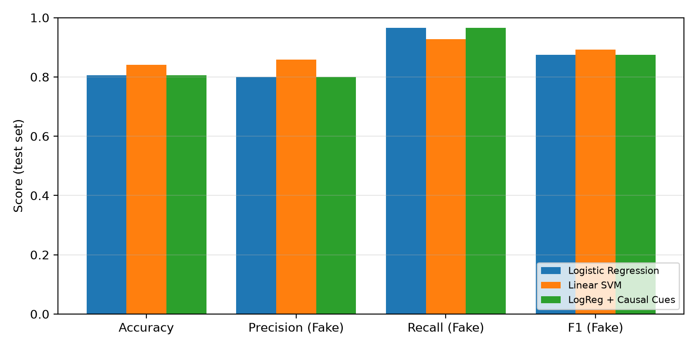

# misinfo-toolkit

[](https://github.com/napp3r/misinfo-toolkit/actions/workflows/ci.yml)

[](LICENSE)
[](https://github.com/astral-sh/ruff)

A small, tested and reproducible Python toolkit for **tweet-level misinformation detection**.
It packages the classical baselines from the paper *"Fake News Detection on Twitter Using
Machine Learning"* (D. Karatay, IEEE SIST 2026) for the
[MiDe22](https://github.com/ogozcelik/MiDe22) dataset:

* tweet preprocessing (URL / mention removal, hashtag normalisation, tokenisation);
* **causal cue** features: connectives (*because, therefore*), causative verbs (*causes, led to*)
  and "X causes Y" patterns;
* models: TF-IDF + Logistic Regression, TF-IDF + Linear SVM, TF-IDF + causal cues;
* stratified 70/10/20 splits with a fixed seed, evaluation with the *fake* class as positive;
* a `misinfo` command-line tool and machine-readable reports (JSON, CSV, Markdown, PNG).

## Results on MiDe22 (English)

Binary task (2,456 tweets, 70.4 % misinformation), stratified 70/10/20 split, seed 42,
test set n = 492, positive class = misinformation. Produced with `misinfo evaluate`
([results/mide22](results/mide22)); the TF-IDF numbers reproduce the paper exactly.

| Model | Accuracy | Precision (Fake) | Recall (Fake) | F1 (Fake) |
|---|---|---|---|---|
| TF-IDF + Logistic Regression | 0.8049 | 0.7990 | **0.9653** | 0.8743 |
| **TF-IDF + Linear SVM** | **0.8415** | 0.8583 | 0.9277 | **0.8917** |
| TF-IDF + Causal Cues (LogReg) | 0.8049 | 0.7990 | **0.9653** | 0.8743 |
| BERT fine-tuned *(paper, not in toolkit)* | 0.8394 | **0.8782** | 0.8960 | 0.8870 |
| BERT + Causal Cues *(paper, not in toolkit)* | 0.8171 | 0.8699 | 0.8699 | 0.8699 |

The linear SVM matches or beats fine-tuned BERT on accuracy and F1 at a fraction of the cost.
The 28 binary cue features do not change the logistic regression predictions: they are
swamped by 5,000 TF-IDF features, which is consistent with the paper's finding that naive
late fusion of causal cues does not help.



## Installation

```bash
git clone https://github.com/napp3r/misinfo-toolkit.git
cd misinfo-toolkit
python -m venv .venv && source .venv/bin/activate    # Windows: .venv\Scripts\activate
pip install -e .            # core library + CLI
pip install -e ".[dev]"     # + pytest, ruff, pre-commit (for contributors)
```

## Quick start (synthetic sample data)

The repository ships `data/sample/sample_tweets.csv` - **240 synthetic, template-generated
tweets** (see `scripts/make_sample_data.py`) with the same schema as the real data.

```bash
misinfo split data/sample/sample_tweets.csv -o data/splits
misinfo evaluate data/splits -o reports          # -> reports/results.{json,csv,md}, metrics.png
misinfo train data/sample/sample_tweets.csv -m logreg_cues -o models/model.joblib
misinfo predict --model models/model.joblib "BREAKING: 5G towers secretly cause panic!!"
```

Or from Python:

```python
from misinfo_toolkit.data import load_dataset, stratified_split
from misinfo_toolkit.evaluate import run_experiment, results_table

splits = stratified_split(load_dataset("data/sample/sample_tweets.csv"))
print(results_table(run_experiment(splits, ["logreg", "svm", "logreg_cues"])))
```

## Using the real MiDe22 data

MiDe22 is published as **tweet IDs only** (Twitter/X terms of service), so tweet texts are
not included in this repository. Obtain the dataset from the
[official repository](https://github.com/ogozcelik/MiDe22), hydrate the tweets so the TSV
has a `text` column, then:

```bash
misinfo prepare path/to/mide22_en_misinfo_tweets.tsv -o data/processed/mide22_en.csv
misinfo split data/processed/mide22_en.csv -o data/splits
misinfo evaluate data/splits -o results/mide22
```

`prepare` keeps the `True`/`False` labels (False -> 1 = misinformation, True -> 0 = truthful)
and drops `Other`. `data/processed`, `data/splits` and `models/` are git-ignored.

## Demo app

An optional [Streamlit](https://streamlit.io) app lets you paste a tweet, pick a model and see
the misinformation score with the detected causal cues highlighted.

```bash
pip install -e ".[app]"
streamlit run app/streamlit_app.py
```

If `models/model.joblib` exists (e.g. trained on MiDe22 with `misinfo train`) the app offers it;
otherwise the models are trained on the synthetic sample data at start-up. The app can be deployed
to Streamlit Community Cloud as is (`requirements.txt` installs the package with the `app` extra).

## CLI reference

| Command | Purpose |
|---|---|
| `misinfo prepare TSV -o CSV` | Binarise a hydrated MiDe22 TSV into a `text,label` CSV |
| `misinfo split CSV -o DIR [--val-size --test-size --seed]` | Stratified train/val/test split |
| `misinfo evaluate DIR -o OUT [-m logreg svm logreg_cues]` | Train on train, validate, refit on train+val, test, write report |
| `misinfo train CSV -m MODEL -o FILE` | Fit one model on all rows and save it (joblib) |
| `misinfo predict TEXT... --model FILE` | Print a misinformation score and verdict per text |

## Project structure

```
src/misinfo_toolkit/
  preprocess.py   # clean_tweet(), tokenize()
  cues.py         # causal cue features + span finder
  data.py         # MiDe22 loader, binarisation, stratified split
  models.py       # model factory, scoring, save/load
  evaluate.py     # metrics, experiment protocol, reports
  cli.py          # `misinfo` command
app/              # Streamlit demo
tests/            # pytest suite (unit + end-to-end)
data/sample/      # synthetic demo dataset
docs/             # technology choices
.github/          # CI workflow, issue/PR templates, dependabot
```

## Development

```bash
pip install -e ".[dev]"
pre-commit install                     # run ruff on every commit
ruff check . && ruff format --check .  # lint
pytest --cov                           # tests, coverage gate 85 %
```

See [CONTRIBUTING.md](CONTRIBUTING.md) for the branch / commit / PR workflow.

## Continuous integration

Every push and pull request runs [`.github/workflows/ci.yml`](.github/workflows/ci.yml):

1. **Lint** - `ruff check` and `ruff format --check`;
2. **Test** - pytest with coverage on Python 3.10 / 3.11 / 3.12 (Ubuntu) and 3.12 on Windows and macOS;
3. **Reproducibility run** - executes the full CLI pipeline on the sample data and publishes the
   results table in the job summary and as an artifact;
4. **Build** - builds the wheel / sdist and validates them with `twine check`.

## Continuous delivery

Pushing a version tag runs [`.github/workflows/release.yml`](.github/workflows/release.yml):
it checks that the tag matches the version in `pyproject.toml`, runs the tests, builds the
wheel and sdist and publishes them as a [GitHub Release](https://github.com/napp3r/misinfo-toolkit/releases).

```bash
git tag v0.1.0 && git push origin v0.1.0
```

Dependencies and GitHub Actions versions are kept up to date by
[Dependabot](.github/dependabot.yml).

## Technology choices

Python + scikit-learn + pandas, pytest, ruff, GitHub Actions - the rationale for each choice is
in [docs/TECHNOLOGY.md](docs/TECHNOLOGY.md).

## Citation

If you use this toolkit, please cite it via [CITATION.cff](CITATION.cff) and cite the MiDe22
dataset (Toraman et al., LREC-COLING 2024).

## License

[MIT](LICENSE) © 2026 Dair Karatay
